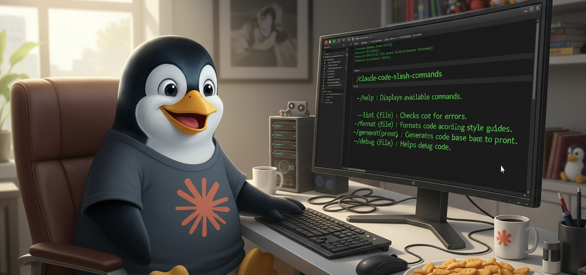

# Claude Code Linux Desktop Slash Commands



[](https://claude.com/claude-code)
[](https://www.linux.org/)
[](https://ubuntu.com/)
[](https://github.com/danielrosehill/Claude-Code-Repos-Index)
[](https://github.com/danielrosehill/Github-Master-Index)

A comprehensive collection of slash commands for Claude Code CLI designed to streamline system administration, optimization, and configuration tasks on Linux desktop systems.

## Quick Start: Desktop SysAdmin Workspace

### Automated Workspace Setup

This repository includes a setup script that creates a dedicated Claude Code workspace for desktop system administration at `~/claude-spaces/desktop-sys-admin`.

**Run the setup script:**
```bash
bash ~/repos/github/Claude-Code-Linux-Desktop-Slash-Commands/setup-desktop-sysadmin-workspace.sh
```

**What the script does:**
1. Creates workspace directory structure at `~/claude-spaces/desktop-sys-admin`
2. Syncs all 93+ slash commands to `.claude/commands/` (organized by category)
3. Generates `CLAUDE.md` with workspace configuration and instructions
4. Gathers current system information (CPU, GPU, RAM, OS, network, dev tools) into `context/system-info.md`
5. Creates user-facing `README.md` documentation
6. Initializes a git repository for version control
7. Sets up `.gitignore` for temporary files

**Using the workspace:**
```bash
cd ~/claude-spaces/desktop-sys-admin
claude-code
```

Once in the workspace, Claude Code has full context about your system and access to all slash commands. Type `/` to see available commands organized by category.

**Updating the workspace:**

Re-run the setup script to sync the latest slash commands and refresh system information:
```bash
bash ~/repos/github/Claude-Code-Linux-Desktop-Slash-Commands/setup-desktop-sysadmin-workspace.sh
```

The script uses `rsync` to efficiently update only changed files while preserving the directory structure.

## Command Structure & Organization

### Two Directory Structures

This repository maintains slash commands in **two parallel structures**:

1. **`commands/`** - Organized by category in nested directories (primary source)
2. **`commands-flat/`** - Flattened structure with all commands in one directory

### Flattening Workflow

The `flatten-commands.sh` script converts the categorized structure into a flat structure for easy deployment to Claude Code workspaces.

**Run the flattening script:**
```bash
bash ~/repos/github/Claude-Code-Linux-Desktop-Slash-Commands/flatten-commands.sh
```

**What the script does:**
1. Clears the `commands-flat/` directory
2. Recursively finds all `.md` files in `commands/`
3. Flattens the directory structure by replacing `/` with `-` in filenames
4. Copies all commands to `commands-flat/`

**Example transformation:**
```
commands/system-health/system-upgrade.md → commands-flat/system-health-system-upgrade.md
commands/security/probe-vulnerabilities.md → commands-flat/security-probe-vulnerabilities.md
```

**When to use flattening:**
- Before copying commands to a Claude Code workspace
- When you need all commands in a single directory
- For easier deployment without preserving category structure

**Note:** The `setup-desktop-sysadmin-workspace.sh` script uses the categorized `commands/` structure (not the flattened version) to maintain organization in the workspace.

## Categories

### [AI Tools](./commands/ai-tools)
Local AI inference (Ollama), GPU configuration, model management, speech-to-text setup, ComfyUI

### [Audio](./commands/audio)
PipeWire optimization and audio configuration

### [Backup](./commands/backup)
Backup planning, target identification, backup strategies, cloud storage setup (rclone, B2, AWS)

### [Configuration](./commands/configuration)
Git config, SSH keys, MCP servers, API keys, environment management

### [Debugging](./commands/debugging)
System diagnostics, troubleshooting, crash analysis, performance debugging

### [Development Tools](./commands/dev-tools)
Docker setup, IDE suggestions, VS Code optimization

### [Filesystem Organization](./commands/filesystem-organization)
File organization, folder consolidation, structure optimization

### [Fonts](./commands/fonts)
Font management, Google Fonts installation

### [Hardware](./commands/hardware)
Hardware profiling, GPU management, wake device control

### [Installation](./commands/installation)
CLI tool installation (gh, pipx, brew, rclone, AWS CLI, B2 CLI)

### [Management](./commands/mgmt)
Repository management utilities

### [Media](./commands/media)
Codec checking and recommendations

### [Network](./commands/network)
LAN scanning, connectivity diagnostics, network troubleshooting

### [Optimization](./commands/optimisation)
System optimization and performance tuning

### [Package Management](./commands/package-management)
Package cleanup, software evaluation, repository management

### [Program Management](./commands/program-management)
Application management and organization

### [Python](./commands/python)
pyenv setup, conda environments for data analysis, ROCm, LLM/STT fine-tuning

### [Repositories](./commands/repositories)
Repository management and version control

### [Security](./commands/security)
Vulnerability scanning, spyware detection, firewall analysis, security auditing

### [Storage](./commands/storage)
Storage health monitoring, BTRFS/Snapper checks, RAID configuration, network mounts

### [System Health](./commands/system-health)
Boot logs, slowdown diagnosis, health checkups, system upgrades, startup services

### [Utilities](./commands/utilities)
Printer diagnostics, general system utilities

### [Virtualization](./commands/virtualization)
Virtualization capabilities and configuration

## Related

[Claude Slash Commands](https://github.com/danielrosehill/Claude-Slash-Commands) - General collection of slash commands for Claude AI
